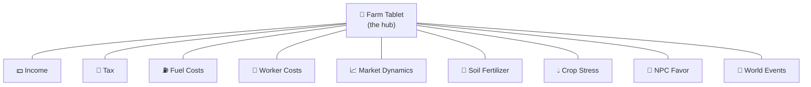

# 🚜 Realistic Farming

### An FS25 mod suite by **TheCodingDad**

*Realism, one system at a time — income, costs, soil, labor, markets, and the tablet to run it all. Built to work together.*

---

## 🌾 Start here

The suite has a center of gravity: **Farm Tablet**. Open it in-game (default **T**) and it *auto-detects* the other mods, turning each one into an app — your whole farm economy, soil, labor, and market data in one place.

> **New here?** Install **Farm Tablet** first, then add the systems you want. Each mod works on its own, but together they form a single connected farm-management layer.

---

## 📦 The Suite

### 💰 Economy & Finance
| Mod | What it does |
|-----|--------------|
| 📱 **[Farm Tablet](https://github.com/Realistic-Farming/FS25_FarmTablet)** | In-game tablet UI — the hub that detects every other mod and launches it as an app. |
| 💵 **[Income Mod](https://github.com/Realistic-Farming/FS25_IncomeMod)** | Configurable passive income — hourly or daily, difficulty-based or custom. |
| 🧾 **[Tax Mod](https://github.com/Realistic-Farming/FS25_TaxMod)** | Realistic tax on farm income and assets — prosperity comes with paperwork. |
| ⛽ **[Fuel Costs](https://github.com/Realistic-Farming/FS25_FuelCosts)** | Dynamic fuel pricing — daily market swings, seasonal cycles, real operating costs. |
| 👷 **[Worker Costs](https://github.com/Realistic-Farming/FS25_WorkerCosts)** | Skill-based worker wages with configurable hourly rates — pay them what they're worth. |
| 📈 **[Market Dynamics](https://github.com/Realistic-Farming/FS25_MarketDynamics)** | Dynamic crop pricing — world events, intraday volatility, and futures contracts. |
| 🏷️ **[Workplace Triggers](https://github.com/Realistic-Farming/FS25_WorkplaceTriggers)** | Turn any location into a paid workplace — clock in and earn while you're on the job. |

### 🌱 Land & Crops
| Mod | What it does |
|-----|--------------|
| 🧪 **[Soil Fertilizer](https://github.com/Realistic-Farming/FS25_SoilFertilizer)** | Per-field N/P/K, pH, and organic matter — crop-specific depletion, weather, and seasons. |
| 💧 **[Seasonal Crop Stress](https://github.com/Realistic-Farming/FS25_SeasonalCropStress)** | Soil moisture, crop stress, and irrigation — real drought mechanics. Water or lose the harvest. |
| 🏭 **[Fertilizer Depot](https://github.com/Realistic-Farming/FS25_FertilizerDepot)** | A placeable depot to buy, store, and sell every fertilizer type at seasonal prices. |

### 👥 Life & World
| Mod | What it does |
|-----|--------------|
| 🤝 **[NPC Favor](https://github.com/Realistic-Farming/FS25_NPCFavor)** | Living NPC neighbors with AI field schedules and a favor system — build relationships or risk goodwill. |
| 🎲 **[Random World Events](https://github.com/Realistic-Farming/FS25_RandomWorldEvents)** | 43+ dynamic events and a physics overhaul — no two playthroughs are the same. |

### 🧰 Tools
| Tool | What it does |
|-----|--------------|
| 🛠️ **[Soil Layer Installer](https://github.com/Realistic-Farming/FS25_SoilLayerInstaller)** | One-click patch any map mod with per-pixel soil nutrient layers for Soil Fertilizer. |
| 🎯 **[Custom Trigger Creator](https://github.com/Realistic-Farming/FS25_CustomTriggerCreator)** | In-game tool for creating custom interaction triggers. |

---

## 🔗 How they fit together

Farm Tablet is the front-end; the other mods are the engines behind it.

Each spoke is optional — Farm Tablet shows an app only when that mod is installed, so the tablet grows with your setup.

---

## ⬇️ Installing

1. Download the latest release `.zip` from each mod's **Releases** page (links above).
2. Drop the zips into your FS25 `mods` folder:
   `Documents\My Games\FarmingSimulator2025\mods\`
3. Enable them in-game. Start with **Farm Tablet**, then add the rest.

> Every mod is standalone — install only what you want. No master pack required.

---

*Built for farmers who like their simulators a little more demanding.* 🌽

