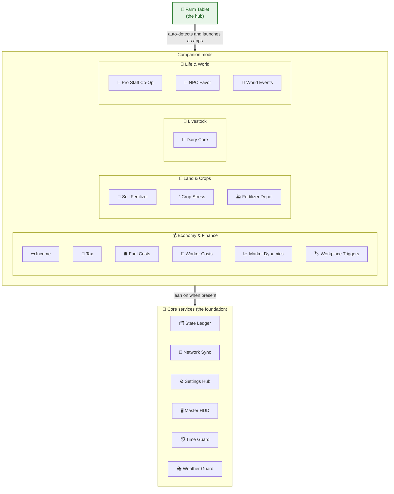

# Realistic Farming

### An FS25 mod suite by **TheCodingDad**

*Realism, one system at a time: income, costs, soil, livestock, labor, and markets, on a shared core-services foundation. Built to work together.*

---

## 👥 Who we are

The suite is built by four people:

| Who | What they do |
|-----|--------------|
| **Tison** (TheCodingDad) | Builds the mods and ships the releases. |
| **Arissani** | Designs the systems and how they fit together. |
| **WizardlyPayload** | Crafts the UI, HUD, and the shared Esc and tablet chrome. |
| **Sasha** | Community manager. Handles releases, notes, and player reports. |

---

## 🌐 Community

| Where | What it is |
|-------|------------|
<!-- PORTAL_LINK_BEGIN -->
| 🌐 **[FS25 Portal](https://landscapes-architects-architect-hybrid.trycloudflare.com)** | Changelogs, the roadmap, and posts from the team. |
<!-- PORTAL_LINK_END -->
| 🐙 **[GitHub org](https://github.com/Realistic-Farming)** | All the mods and core services, here. |

---

## 🌾 Start here

The suite has a center of gravity: **Farm Tablet**. Open it in-game (default **T**) and it *auto-detects* the other mods, turning each one into an app. Your whole farm economy, soil, livestock, labor, and market data live in one place.

Underneath the mods you play with sits a set of **core services**: shared plumbing for saving, multiplayer sync, settings, on-screen HUD, economic time, and weather. You do not interact with them directly. They just make the rest of the suite fast, reliable, and safe in multiplayer.

> **New here?** Install **Farm Tablet** first, then add the systems you want. Each mod works on its own, but together they form a single connected farm-management layer.

---

## 📟 One suite home in the pause menu

Open the **Esc** menu and the Realistic Farming entry is one suite home, not a row of separate mod tabs. The shared chrome keeps a side column with the module list and lime arrows to switch, and a main pane showing the active mod's glance. It looks and behaves the same whether you have one mod or many.

- **One door.** When a mod joins this system, its old separate Esc/PDA tab is replaced by the single Realistic Farming entry. No second icon, no duplicated suite story.
- **Grows with what you have.** The module list only shows the mods you have installed. One mod means one entry; several combine into one menu.
- **Any capable mod can host.** The chrome is peer-hosted: a capable companion hosts when it is alone or elected, and the others register into it. **Soil Fertilizer** ships the reference implementation today; the rest of the suite joins as its module briefs are approved.
- **Glance, not a rebuild.** The pause-menu PDA is a quick look while you are stopped. Deep workflows stay in Farm Tablet. The two complement each other; neither replaces the other.

---

## 🧱 Core Services (the foundation)

Shared infrastructure that every companion mod can lean on. Each companion runs fine without them and simply gains reliability when they are present, so you only ever add what you want.

| Service | What it does |
|---------|--------------|
| 🗂️ **[State Ledger](https://github.com/Realistic-Farming/FS25_StateLedger)** | Save bedrock. Collapses every companion mod's savegame into one atomic write, so a crash mid-save can no longer corrupt or lose progression. |
| 🔌 **[Network Sync](https://github.com/Realistic-Farming/FS25_NetworkSync)** | Multiplayer bedrock. One batched 1 Hz sync cycle replaces per-mod network events to cut traffic and stop cross-mod rubber-banding. |
| ⚙️ **[Settings Hub](https://github.com/Realistic-Farming/FS25_SettingsHub)** | Settings bedrock. A throttled async queue applies heavy setting changes smoothly, with server-synced admin settings in multiplayer. |
| 🖥️ **[Master HUD](https://github.com/Realistic-Farming/FS25_MasterHUD)** | UI bedrock. One shared draw loop renders every companion overlay in a pull model to cut per-frame HUD overhead. |
| ⏱️ **[Time Guard](https://github.com/Realistic-Farming/FS25_TimeGuard)** | Economic-time bedrock. One canonical calendar clock so every economy mod accrues and settles on the same day, month, and year. |
| 🌦️ **[Weather Guard](https://github.com/Realistic-Farming/FS25_WeatherGuard)** | Weather bedrock. One reading of the sky the whole suite agrees on: current conditions, the forward forecast, and a shared climate dial. It publishes the weather and never decides what a mod does with it. |

---

## 📦 The Suite

### 💰 Economy & Finance
| Mod | What it does |
|-----|--------------|
| 📱 **[Farm Tablet](https://github.com/Realistic-Farming/FS25_FarmTablet)** | In-game tablet UI. The hub that detects every other mod and launches it as an app. |
| 💵 **[Income Mod](https://github.com/Realistic-Farming/FS25_IncomeMod)** | Configurable passive income, hourly or daily, difficulty-based or custom. |
| 🧾 **[Tax Mod](https://github.com/Realistic-Farming/FS25_TaxMod)** | Realistic tax on farm income and assets. Prosperity comes with paperwork. |
| ⛽ **[Fuel Costs](https://github.com/Realistic-Farming/FS25_FuelCosts)** | Dynamic fuel pricing with daily market swings, seasonal cycles, and real operating costs. |
| 👷 **[Worker Costs](https://github.com/Realistic-Farming/FS25_WorkerCosts)** | Skill-based worker wages with configurable hourly rates. Pay them what they're worth. |
| 📈 **[Market Dynamics](https://github.com/Realistic-Farming/FS25_MarketDynamics)** | Dynamic crop pricing with world events, intraday volatility, and futures contracts. |
| 🏷️ **[Workplace Triggers](https://github.com/Realistic-Farming/FS25_WorkplaceTriggers)** | Turn any location into a paid workplace. Clock in and earn while you're on the job. |

### 🌱 Land & Crops
| Mod | What it does |
|-----|--------------|
| 🧪 **[Soil Fertilizer](https://github.com/Realistic-Farming/FS25_SoilFertilizer)** | Per-field N/P/K, pH, and organic matter with crop-specific depletion, weather, and seasons. |
| 💧 **[Seasonal Crop Stress](https://github.com/Realistic-Farming/FS25_SeasonalCropStress)** | Soil moisture, crop stress, and irrigation. Real drought mechanics: water or lose the harvest. |
| 🏭 **[Fertilizer Depot](https://github.com/Realistic-Farming/FS25_FertilizerDepot)** | A placeable depot to buy, store, and sell every fertilizer type at seasonal prices. |

### 🐄 Livestock
| Mod | What it does |
|-----|--------------|
| 🐄 **[Dairy Core](https://github.com/Realistic-Farming/FS25_DairyCore)** | Per-barn dairy management: herd health, milk quality, spoilage, collection, and contracts. |

### 👥 Life & World
| Mod | What it does |
|-----|--------------|
| 👥 **[NPC Favor](https://github.com/Realistic-Farming/FS25_NPCFavor)** | Living NPC neighbors with AI field schedules and a favor system. Build relationships or risk goodwill. |
| 🎲 **[Random World Events](https://github.com/Realistic-Farming/FS25_RandomWorldEvents)** | 43+ dynamic events and a physics overhaul. No two playthroughs are the same. |
| 🤝 **[Pro Staff Co-Op](https://github.com/Realistic-Farming/FS25_ProStaffCoOp)** | A 20-level cooperative progression backbone: shared goals and staff advancement across the suite. |

> **Note:** the Soil Layer Installer is **no longer needed**. Soil Fertilizer builds its per-pixel soil layers at runtime on any map, so the old one-click map patch is retired. If you already ran it, your map keeps working as a fallback; new installs should just skip it.

---

## 🔗 How they fit together

Farm Tablet is the front-end. The companion mods are the engines. The core services are the shared foundation they all sit on.

```mermaid
flowchart TB
    T["📱 Farm Tablet<br/>(the hub)"]

    subgraph APPS["Companion mods"]
        direction LR
        subgraph ECO["💰 Economy & Finance"]
            I["💵 Income"]
            X["🧾 Tax"]
            F["⛽ Fuel Costs"]
            W["👷 Worker Costs"]
            M["📈 Market Dynamics"]
            WT["🏷️ Workplace Triggers"]
        end
        subgraph LAND["🌱 Land & Crops"]
            S["🧪 Soil Fertilizer"]
            C["💧 Crop Stress"]
            FD["🏭 Fertilizer Depot"]
        end
        subgraph LIV["🐄 Livestock"]
            D["🐄 Dairy Core"]
        end
        subgraph WORLD["👥 Life & World"]
            P["🤝 Pro Staff Co-Op"]
            N["👥 NPC Favor"]
            R["🎲 World Events"]
        end
    end

    subgraph CORE["🧱 Core services (the foundation)"]
        direction LR
        SL["🗂️ State Ledger"]
        NS["🔌 Network Sync"]
        SH["⚙️ Settings Hub"]
        MH["🖥️ Master HUD"]
        TG["⏱️ Time Guard"]
        WG["🌦️ Weather Guard"]
    end

    T ==>|auto-detects and launches as apps| APPS
    APPS ==>|lean on when present| CORE

    classDef hub fill:#e8f5e9,stroke:#2e7d32,stroke-width:2px,color:#1b5e20;
    class T hub;
```

Each companion is optional. Farm Tablet shows an app only when that mod is installed, so the tablet grows with your setup. Core services are optional too: a companion detects them when present and runs on its own quiet fallback when they are absent, so nothing hard-breaks if one is missing.

---

## ⬇️ Installing

1. Download the latest release `.zip` from each mod's **Releases** page (links above).
2. Drop the zips into your FS25 `mods` folder:
   `Documents\My Games\FarmingSimulator2025\mods\`
3. Enable them in-game. Start with **Farm Tablet**, then add the rest. If you run several economy mods together, add the core services too for the smoothest multiplayer and save behavior.

> Every mod is standalone. Install only what you want. No master pack required.

---

*Built for farmers who like their simulators a little more demanding.* 🌽

